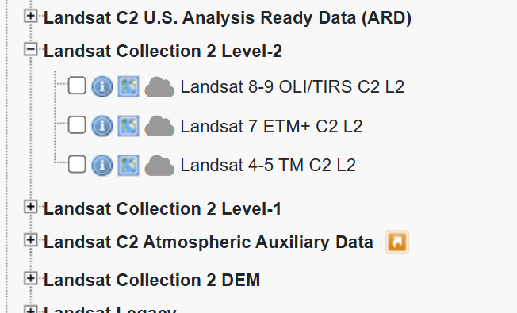
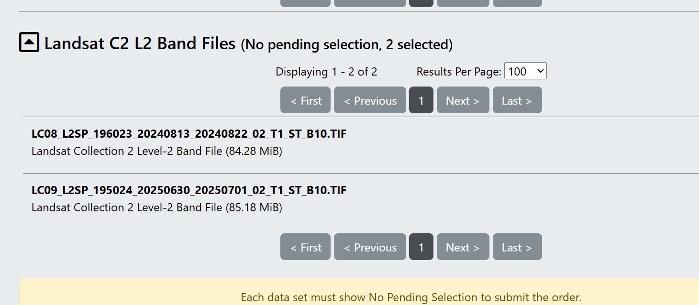

## alle Links: https://docs.google.com/spreadsheets/d/1HtIPbKwRpJ-q7E0P7C0_aEcHx90r7av7aSOC-zbJO8k/edit?gid=668938929#gid=668938929

# Start

Unterschied zwischen Surface air - 2m über dem Boden. 
Land surface temp LST - das ist aussagekräftiger was z. b. die Beton speichert. 

surface air - gefphlte Temperatur. Wird über Sensoren gemessen, das ist gut. 
Problem: Wir sehen nicht, wie heiß exakt es an Spot 1 oder 2 ist. 

LST - ist cool, weil wir jeden Meter analysieren können, aber Problem: ist mal bewölkt, Bäume und Buildings verzerren das Ergebnis. Aber: wir erkennen, wo es Hitzespots gibt etc. 

## Woher kommen die Daten? 
**Landsat**: NASA, Global coverage, 100m-resolution, resample auf 30m, temporal resolution 16 days, 
**Copernicus**: ESA, resolution 1000m, machine-learning auf 30m, temporal resolution 1 day. 

# Vorbereitung
### sample size
Am besten so viel Material wie möglich von der jeweiligen Periode, die man auswerten möchte, z.b. sommer 2025

## Temperature
Man sollte Tage beobachten, die mindestens 30 Grad heiß sind

## Clouds
immer ein Problem, vorher checken. Gute Einstellung ist Cloudcoverage bis zu 30%, weil man da oft trotzdem noch viele Stellen beobachten kann. 

Insgesamt kann man natürlich immer ein bisschen an den Schrauben drehen, z. B. die Temperatur runter oder Mai/September mit reinnehmen etc.

Interessantes Feld: Kann man da mit Drohnen was machen? Wusste Max nicht. 

# Tools
Landsat Earth-Explorer

github.com/maxdonheiser

# Monitoring Desaster Copernicus
https://mapping.emergency.copernicus.eu

Alle Fluten haben eine eigene ID. Über diese ID kann man dann die API ansteuern und alle Infos dort herausholen. 

# Wie zieht man Daten von Copernicus
Am besten über die API. Dort übergibt man die ID der Flut und erhält alle Informationen, die man auch über die Browser-Funktion erhalten hätte. 

## Daten sammeln
Wir müssen erstmal die ganzen IDs einsammeln, die müssen wir filtern und der API übergeben. 

### Höchststand der Flut
Den Höchststand der Flut kann ich feststellen, wenn ich die Zahl der effected people betrachte. Dort, wo sie am höchsten ist, ist auch die Flut am höchsten. 

### welches Polygon? 
Man muss sich das wirklich im Browser anschauen. Copernicus zieht um die Gebiete ein zufälliges Polygon. Darin sind dann viele kleine Polygone, dort wo einzelne Flutevents vorkommen. Meisten ist das aber so: Das große Polygon schließt alle effected people ein, die kleinen immer nur einen Teil. So ganz habe ich es nicht verstanden, aber es ist wohl meist eine gute Idee, das große Polygon zu nehmen. 

### Bei der Auswertung
Man muss die Kategorien vergrößern. Mal ins Colab schauen. 

### offene Fragen
Kann ich die Daten eigentlich als geojson runterladen? 

# Geodaten
## Projections
Das große Problem: Wenn die Welt eine Orange wäre, wie würde man sie schälen? Oder anders gesagt: Wie würde man dafür sorgen, dass die Verzerrungen möglichst klein sind. 

## Rasters & Vectors
### Rasters
wie ein jpeg, jeder Pixel hat einen Wert, wird pixelig wenn man ranzoomt 
### vectors
Polygone, Pnkte etc. - kann vergrößert werden ohne Qualitätsverlust. 
svg, geojson etc. 

## NUTS
von 0 - countries bis 4 Local administrative 

sentinel-hub.com

https://github.com/maxdonheiser/dh25-ladsat-R

bit.ly/Sat_class

# USGS - NASA-Satelliten

username: christoph_
Fraport_2026

Viewer unter: https://earthexplorer.usgs.gov/

## Schritt 1 - Geodaten einzeichnen
Das können die genauen Stadtgrenzen sein (Übergabe als geojson oder so)
man kann das aber auch einfach einzeichnen. Wenn keine Verbindungslinien auftauchen, nochmal neu laden und nochmal einzeichnen. 

## Zeitraum einstellen
Am besten die Sommermonate. Man kann aber auch die Jahre 2022 bis 2025 einstellen und für jedes Jahr nur die Sommermonate einstellen

## Cloudcover einstellen - 
30 bis 40 Prozent ist okay.  Hab ich jetzt gerade nicht gefunden. 

## Daten anfordern
Jetzt muss ich einstellen, welchen Satelliten ich nutzen möchte, in diese Fall Landsat. 
Dort sind die C2-Leveldaten die besten, danach die 8-9, also: 

Landsat C2L2, danach 8-9
Jetzt erhalten wir diverse Bilder. 

Für die Analyse reichen so 2-5 Bilder.
Aufpassen: Mit Footprint kann man erstmal checken, ob die Stadt auch komplett drauf ist. 

Dann: Kleines gelbes Symbol -> zu bulk-download hinzufügen.

Jetzt müssen wir für den Tag des Datums die Temperatur nachschlagen, z.B. mit wonderground.com oder anderen Diensten. 

In meinem Fall 
30.6.25 - 28 Grad
13.08.24 - 28 Grad

Dann -> Liste/Bucket anschauen, Download. 
In den Downloadas gibt es viele viele voreinstslleungen. 
Temperatur->
Wir wollen jetzt B10, das ist die Oberflächentemperatur
Geht so: Auf die Datensätze klicken, dann Level-2 Surface Temperature Band auswählen, da S-B10 auswählen. Dann Download.

